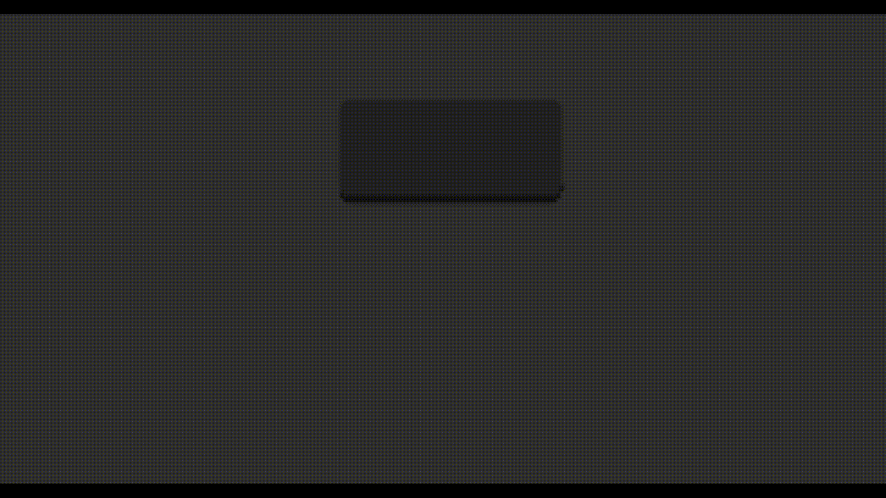

# Carousel

Do you have a rotary encoder that isn't pulling it's weight?
Do you have some obscure characters that you'd use more often if you could ever find them?
Then this is the module for you!

## What does it do?

Carousel allows you to replace a typed character with any other character from a list of alternates.

For example, let's say you often need to type è, é, ê, and ë; as well as à, á, â, ã, ä, and å. Rather than stuffing all 10 of those keycodes into your layout somewhere just type e or a and then scroll through the alternate forms.

That's the main benefit of using carousel, you get easy access to as many characters as you need without bloating your layout; you just have to find room for CSL_L and CSL_R (ideally on an encoder that you aren't using.)

### It's cute, but I don't use diacritics; got any other ideas?
Collapse uncommon symbols to a single key. For example type $ and then scroll through `, \\, ^, %, and |. If you don't write code you could include [, ], {, and } as well.

Add support for emojis. For exammple type ! and then scroll through 😮, 😱, 😡, 🤯, and 😵; or type ? and then scroll through 😮, 🤔, 🙄, and 😒.

Collapse hotkeys when gaming (more useful for split keyboard gaming.)
For example, you could put the hotkeys for all of the placeable items in spacechem in a single carousel and then scroll through them until you find the one you want. Or you could put the numbers in a carousel to scroll through your squads in an RTS (assuming backspace is not bound to anything in game.)

One-up [Ben Vallack's smallest keyboard](https://www.youtube.com/watch?v=XBV0piKtNjI) by creating on a keyboard with one pcb and 0 keys. Simply set scroll left to type a space and scroll right to CSL_R, then set up a single carousel with the entire alphabet and get typing.

## Ok, how do I try it?
Carousel is implemented as a QMK community mod. As you might expect there is a [community modules section in the qmk docs](https://docs.qmk.fm/features/community_modules) and of course there is a lovely [getreuer article about community modules](https://getreuer.info/posts/keyboards/qmk-community-modules/index.html) as well that explains how to get these working.

## It's installed, now what?
**First** if you're going to use unicode you will need to [specify your unicode input mode](https://docs.qmk.fm/features/unicode#input-modes). Add the following to your config.h
```c
#define UNICODE_SELECTED_MODES UNICODE_MODE_LINUX
// or
#define UNICODE_SELECTED_MODES UNICODE_MODE_MACOS
// or
#define UNICODE_SELECTED_MODES UNICODE_MODE_WINCOMPOSE
```

**Second** you need to add the CSL_R and CSL_L keycodes to your keymap somewhere. I bound them to clockwise and counterclockwise on my rotary encoder. *Keep in mind strange things can happen if you scroll too fast.*
```c
const uint16_t PROGMEM encoder_map[][NUM_ENCODERS][NUM_DIRECTIONS] = {
    [BASE] = { ENCODER_CCW_CW(CSL_L, CSL_R) },
};
```
**Finally** you need to define some carousels!
Somewhere in your keymap.c add
```c
const Carousel PROGMEM carousels[CAROUSEL_MAX] = {
    {KC_E,"eèéêë"},
    {KC_A,"aàáâãäå"},
    {KC_DOT,".😁😬😘😭🤬"}
}; 
```
Each carousel starts with the character whose keycode "triggers" the carousel and is followed by the list of alternate characters to scroll through. If you omit the first character then you will not be able to get back to the character that you originally typed. Carousels can have as many or as few alternate characters as you like.

You can have up to 20 carousels.
## But what if I want more?
You can increase the limit by adding the following to your keymap.c.
```c
#define CAROUSEL_MAX 30
```
## Hey, it doesn't work!
If it's missing some alternates or is printing random unicode characters some of the time you likely need to slow down. The way unicode is handled is by sending a series of keystrokes that the OS recognizes and then replaces with the appropriate unicode character. If you go too fast you can interrupt this process and get all sorts of bizarre behavior.

If it's putting a weird box instead of the character that you wanted it's likely the case that the app you're using does not support that character. Try inputting into something more robust, like a browser.